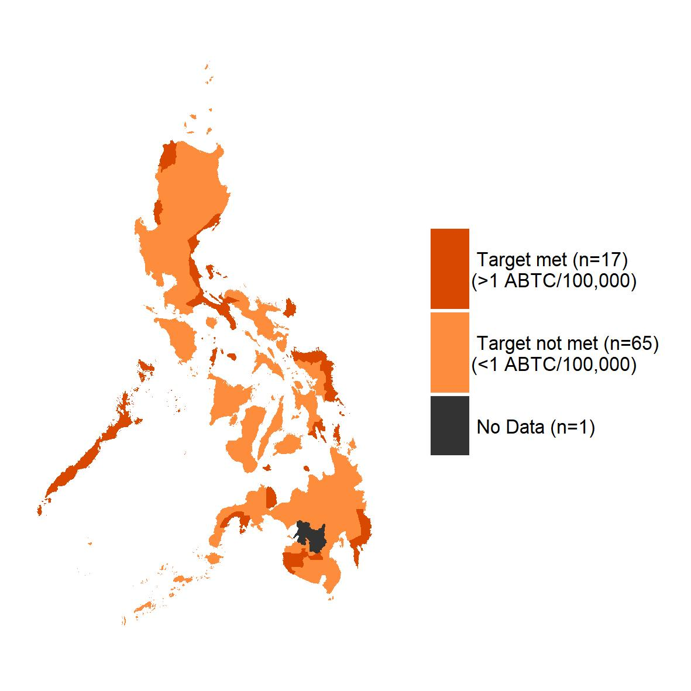
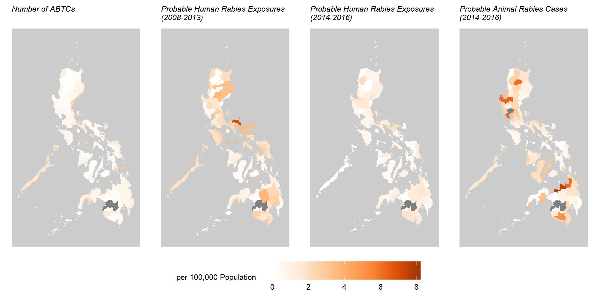

<ol class="breadcrumb" style="background-color:white;">
  <li class="breadcrumb-item"><a href="index.html">Home</a></li>
  <li class="breadcrumb-item active">Background</li>
</ol>

# Background {.tabset}

 

 

<figure>
<figcaption>
<i>
Provinces of the Philippines that have met the target of 1 ABTC/100,000 population; Data taken from <a href="https://journals.plos.org/plosone/article?id=10.1371/journal.pone.0199186" target="blank">Amparo et al (2018) </a>
</i>
</figcaption>

</figure>

 

<figure>
  <figcaption>
  <i>
  Incidence of probable human Rabies exposures/100,000 population (2008-2013 and 2014-2016) and probable animal Rabies cases/100,000 population (2014-2016) in Provinces of the Philippines; Data taken from <a href="https://journals.plos.org/plosone/article?id=10.1371/journal.pone.0199186" target="blank">Amparo et al (2018) </a>
  </i>
  </figcaption>  
   
  

  
  

</figure>

