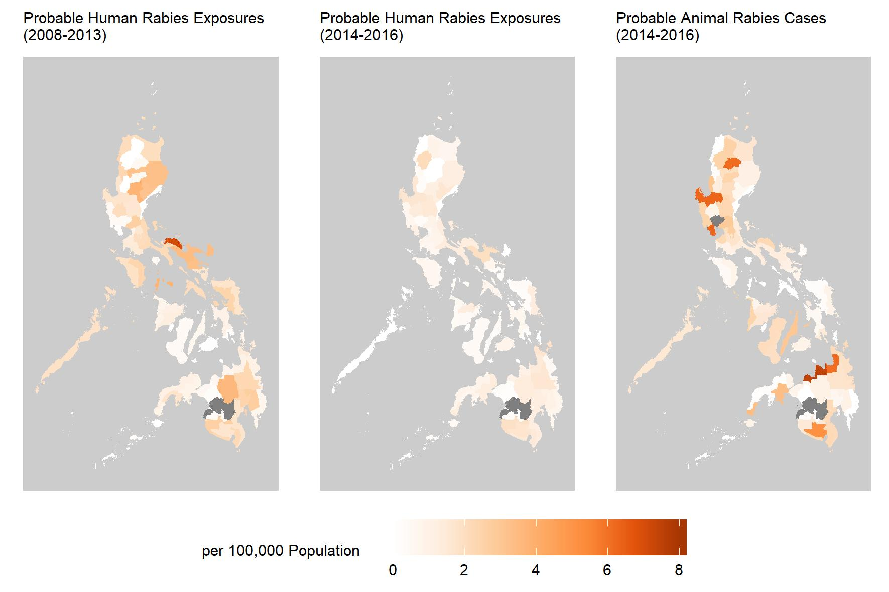

<ol class="breadcrumb" style="background-color:white;">
  <li class="breadcrumb-item"><a href="index.html">Home</a></li>
  <li class="breadcrumb-item active">Background</li>
</ol>

# Background {.tabset}

 

 

<figure>
  <figcaption><i>Number of Animal Bite Treatment Centers (ABTCs) and incidence of probable Rabies cases/exposures per 100,000 population in Provinces of the Philippines (2008-2013 and 2014-2016); Data taken from <a href="https://journals.plos.org/plosone/article?id=10.1371/journal.pone.0199186" target="blank">Amparo et al (2018) </a></i></figcaption>  
   
  
</figure>
