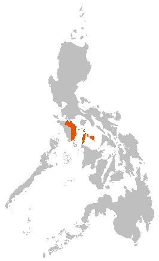

# SPEEDIER  
#### _Surveillance integrating Phylogenetics and Epidemiology for Elimination of Disease: Evaluation of Rabies Control in the Philippines_

 

Rabies is endemic in the Philippines where it causes 200-250 deaths each year. The national control programme has reduced rabies incidence, but use of life-saving post exposure prophylaxis (PEP) is still costly and surveillance needs strengthening to confirm and maintain freedom in areas where control efforts have eliminated rabies.

SPEEDIER aims to introduce revised surveillance protocols (Integrated Bite Case Management - IBCM):  
  
  * To increase case detection  
  * To improve PEP use  
  * To benefit from state-of-the-art technology (mobile apps, portable sequencing)  
  * To guide the national control programme  
  * Evaluate the process of implementation, the influence of context, and mechanisms of action on outcome  
  * Develop a replicable package for scaling up IBCM using best practice and a proven cost-effective template for verifying and sustaining rabies freedom  

Please follow our progress and key events on Twitter by searching for <a href="https://twitter.com/search?q=%23SPEEDIERrabies&src=typd", target="blank">#SPEEDIERrabies</a>
  

  

Our work is generously supported by:    

  

