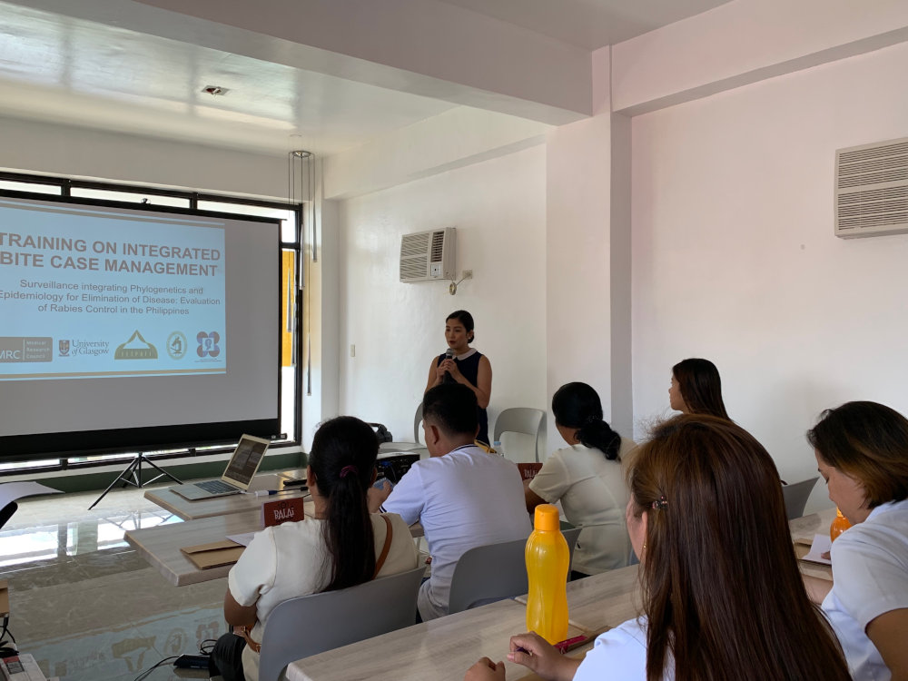
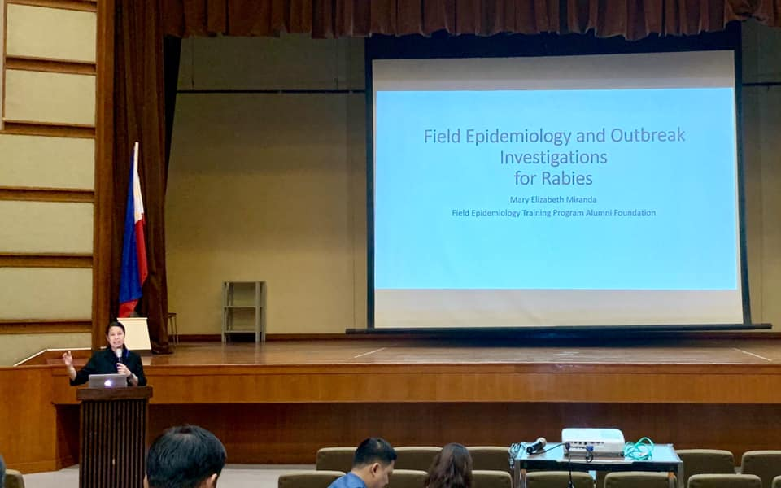
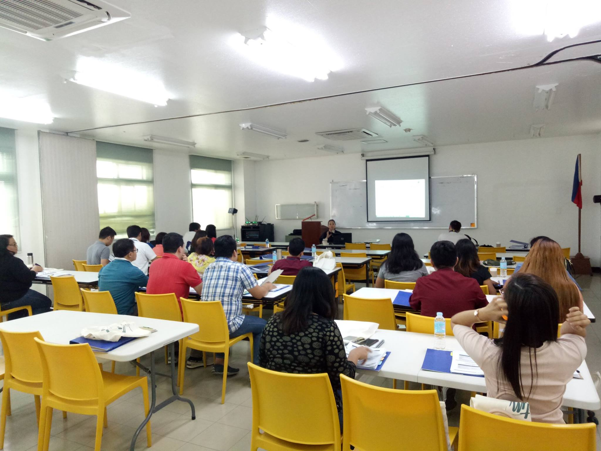

<!--Add a loading bar!-->

<link href="pace_loadbar_loading.css" rel="stylesheet" />

<!-- Add icon library -->

<!-- Create a link to the top of the page -->

<!--Create a block for title and breadcrumbs to appear on same line-->

# News

<ol class="breadcrumb" style="background-color:white;">
  <li class="breadcrumb-item"><a href="index.html">Home</a></li>
  <li class="breadcrumb-item active">News</li>
</ol>

 

<!--Begin page content!-->

<!--Create a block for news section-->

<!------------------------------------------------------------------------------
<!--Add news articles to left hand side of the page-->

<!------------------------------------------------------------------------------
<!--Add a news post - Rabies conference -->

<h2>IBCM Training</h2>
<h5><em> 3-4th June, 2019 | San Jose, Romblon, Philippines</em></h5>
<!--Add an image-->

<a href="proj_gallery.html#GM_gallery" class="moveTo">

Go to Gallery

</a>

<!--Add text-->
>"Dahil rabies free na kayo, dapat intensive ang animal surveillance."
> `r tufte::quote_footer('Dr. Daria Manalo, Section Head of Research, Veterinary Research Department, RITM')` 

On June 3-4, 2019, the first batch of Integrated Bite Case Management (IBCM)
Training was conducted for the municipality of San Jose, Province of Romblon.
Twelve participants from the Rural Health Unit, Animal Bite Treatment Center and
Municipal Agriculture Office were trained on the management of animal bite and
other exposures, detailed veterinary investigations, DOH and DA reporting systems,
among others.  

The training team is composed of Dr. Mary Elizabeth Miranda (FETPAFI), Dr. Daria
Manalo (RITM), Dr. Rhey Ian Buluag (OIC-MHO San Jose), Dr. Jobin Maestro
(MHO-Alcantara) and FETPAFI local and national staff. The training is part of the
SPEEDIER project, funded by the Newton Agham program.

<!-- Link back to top of the page --> 

<a href="#page_top">Back to top <i class="fas fa-arrow-alt-circle-up"></i></a>

<!------------------------------------------------------------------------------
<!--Add a news post - Rabies conference -->

<h2>Regional Launch - SPEEDIER</h2>
<h5><em> 10th April, 2019 | Odiongan, Romblon, Philippines</em></h5>
<!--Add an image-->

<a href="proj_gallery.html#GM_gallery" class="moveTo">

Go to Gallery

</a>

<!--Add text-->
Provincial launch of the project, Surveillance Integrating Phylogenetics and 
Epidemiology for Elimination of Disease: Evaluation of Rabies Control in the 
Philippines (SPEEDIER).  

Present are representatives from: Romblon Provincial Government, Gov. Eduardo 
Firmalo, Provincial Health Office, Provincial Veterinary Office, DepEd, Municipal 
Health Offices, Municipal Agriculture Offices, Hospitals, Animal Bite Treatment 
Centers, University of Glasgow and FETPAFI.

<!-- Link back to top of the page --> 

<a href="#page_top">Back to top <i class="fas fa-arrow-alt-circle-up"></i></a>

<!------------------------------------------------------------------------------
<!--Add a news post - Rabies conference -->

<h2>National Launch - SPEEDIER</h2>
<h5><em> 2nd April, 2019 | Muntinlupa, Philippines</em></h5>
<!--Add an image-->

<a href="proj_gallery.html#GM_gallery" class="moveTo">

Go to Gallery

</a>

<!--Add text-->
National launch of the project, Surveillance Integrating Phylogenetics and 
Epidemiology for Elimination of Disease: Evaluation of Rabies Control in the 
Philippines (SPEEDIER).  

Present are representatives from: Research Institute for Tropical Medicine, 
Epidemiology Bureau, Disease Prevention and Control Bureau, Doh Mimaropa, 
Department of Agriculture - Bureau of Animal Industry, DOST PCHRD, Provinces of 
Romblon and Oriental Mindoro, University of Glasgow and FETPAFI.

<!-- Link back to top of the page --> 

<a href="#page_top">Back to top <i class="fas fa-arrow-alt-circle-up"></i></a>

<!------------------------------------------------------------------------------
<!--Add a news post - Rabies conference -->

<h2>RITM Rabies Conference</h2>
<h5><em> 18th March, 2019 | Manila, Philippines</em></h5>
<!--Add an image-->

<a href="proj_gallery.html#GM_gallery" class="moveTo">

Go to Gallery

</a>

<!--Add text-->
Dr. Mary Elizabeth Miranda, CEO of FETPAFI, is one of the speakers in the 2019 
Rabies Conference, with the theme "Updates on Rabies Research, Diagnosis and 
Guidelines".  

She will cover 2 presentations, namely: "Field Epidemiology and Outbreak 
Investigations for Rabies" and "Surveillance Integrating Phylogenetics 
and Epidemiology for Elimination of Disease: Evaluation of Rabies Control in the 
Philippines (SPEEDIER)".

<!-- Link back to top of the page --> 

<a href="#page_top">Back to top <i class="fas fa-arrow-alt-circle-up"></i></a>

 
<!------------------------------------------------------------------------------
<!--Add a news post - Rabies conference -->

<h2>RITM Training Course</h2>
<h5><em> 11-13th March, 2019</em></h5>
<!--Add an image-->

<a href="proj_gallery.html#GM_gallery" class="moveTo">

Go to Gallery

</a>

<!--Add text-->
Rabies is an encephalitis that is 100% fatal in humans, but is also 100% preventable 
if prophylactic measures are instituted immediately after exposure. These include 
thorough wound cleaning and administration of potent and effective vaccines and 
rabies immunoglobulin (RIG).  

On March 11-13th 2019, SPEEDIER Project Associate Rosemarie Jane Arroyo attended 
the Training Course on Rabies, Animal Bite Management and Leprosy Recognition 
conducted by the Research Institute of Tropical Medicine (RITM).  

The skills and knowledge gained from the training will be crucial in the 
implementation of FETPAFI's SPEEDIER (rabies elimination) project.

<!-- Link back to top of the page --> 

<a href="#page_top">Back to top <i class="fas fa-arrow-alt-circle-up"></i></a>

<!------------------------------------------------------------------------------
<!--Add a news post - Governor meeting-->

<h2>Governor meeting</h2>
<h5><em> 5th March, 2019</em></h5>
<!--Add an image-->

<a href="proj_gallery.html#GM_gallery" class="moveTo">

Go to Gallery

</a>

<!--Add text-->
SPEEDIER (Surveillance Integrating Phylogenetics and Epidemiology for Elimination 
of Disease: Evaluation of Rabies Control in the Philippines) is a 3-year project 
of FETPAFI in collaboration with the University of Glasgow, DOST-Philippine Council 
for Health Research and Development, Research Institute for Tropical Medicine and 
Department of Health.  

This multi-million project aims to deliver a cost-effective, epidemiologically 
robust, enhanced surveillance and response package to guide and sustain the 
elimination of Rabies from the Philippines.

<!-- Link back to top of the page --> 

<a href="#page_top">Back to top <i class="fas fa-arrow-alt-circle-up"></i></a>

<!--End left hand column-->

<!------------------------------------------------------------------------------
<!--Add list of articles to right side of page-->

<!--Add a section linking to articles-->

Articles

<em><b>June 2019</b></em> 
<ul style="list-style-type: none;">
<li><a href="#2019.06.03">IBCM Training 1</a></li>
</ul>
<em><b>April 2019</b></em> 
<ul style="list-style-type: none;">
<li><a href="#2019.04.10">Regional Launch</a></li>
<li><a href="#2019.04.02">National Launch</a></li>
</ul>
<em><b>March 2019</b></em> 
<ul style="list-style-type: none;">
<li><a href="#2019.03.18">2019 Rabies Conference</a></li>
<li><a href="#2019.03.11">RITM Rabies Training</a></li>
<li><a href="#2019.03.05">Governor Meeting</a>  </li>
</ul>

<!--End left hand column-->

<!--End row-->

  