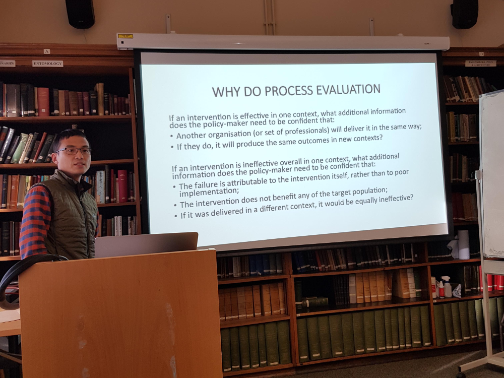

<!-- ---------------------------------------------------------------------- --!>
<!--Add javascript section for tabbed sections!-->

<body onload="document.getElementById('defaultOpen').click();">

<!-- ---------------------------------------------------------------------- --!>
<!--Add javascript section for lightbox!-->

<!-- ---------------------------------------------------------------------- --!>
<!--Add a loading bar!-->

<link href="pace_loadbar_loading.css" rel="stylesheet" />

<!-- ---------------------------------------------------------------------- --!>
<!--Create a block for title and breadcrumbs to appear on same line-->

# Project Gallery

<ol class="breadcrumb" style="background-color:white;">
  <li class="breadcrumb-item"><a href="index.html">Home</a></li>
  <li class="breadcrumb-item">The Project</li>
  <li class="breadcrumb-item active">Project Gallery</li>
</ol>

<!-- ---------------------------------------------------------------------- --!>
<!--Begin page content!-->

<!--Setup tabs!-->

  <button class="tablink" onclick="openPage('1', this, '#DE4815')" id="defaultOpen">Project Inaugural Meetings, Glasgow</button>
  <button class="tablink" onclick="openPage('2', this, '#DE4815')">Governor Meeting, Philippines</button>
  <button class="tablink" onclick="openPage('3', this, '#DE4815')">FETPAFI Meeting, Philippines</button>

<!-- ---------------------------------------------------------------------- --!>
<!-- Tab 1 content -->

<h3>Project Inaugural Meetings, Glasgow</h3>
<em>Please click on a photo to view</em>

<!-- Images used to open the lightbox -->

 <!-- End Gallery -->

<!-- The Modal/Lightbox -->

&times;

<!-- Images in Lightbox -->

1 / 11

2 / 11

3 / 11

4 / 11

5 / 11

6 / 11

7 / 11

8 / 11

9 / 11

10 / 11

11 / 11

<!-- Next/previous controls -->
<a class="prev" onclick="plusSlides1(-1)">&#10094;</a>
<a class="next" onclick="plusSlides1(1)">&#10095;</a>

<!-- Caption text -->

 <!-- End Caption -->

 <!-- End Modal content -->

 <!-- End Lightbox -->

 <!-- End Tab 1 -->

<!-- ---------------------------------------------------------------------- --!>
<!-- Tab 2 content -->

<h3>Governor Meeting, Philippines</h3>
<em>Please click on a photo to view</em>

<!-- Images used to open the lightbox -->

 <!-- End Gallery -->

<!-- The Modal/Lightbox -->

&times;

<!-- Images in Lightbox -->

1 / 3

2 / 3

3 / 3

<!-- Next/previous controls -->
<a class="prev" onclick="plusSlides2(-1)">&#10094;</a>
<a class="next" onclick="plusSlides2(1)">&#10095;</a>

<!-- Caption text -->

 <!-- End Caption -->

 <!-- End Modal content -->

 <!-- End Lightbox -->

 <!-- End Tab 2 -->

<!-- ---------------------------------------------------------------------- --!>
<!-- Tab 3 content -->

<h3>FETPAFI Meeting, Philippines</h3>
<em>Please click on a photo to view</em>

<!-- Images used to open the lightbox -->

 <!-- End Gallery -->

<!-- The Modal/Lightbox -->

&times;

<!-- Images in Lightbox -->

1 / 5

2 / 5

3 / 5

4 / 5

5 / 5

<!-- Next/previous controls -->
<a class="prev" onclick="plusSlides3(-1)">&#10094;</a>
<a class="next" onclick="plusSlides3(1)">&#10095;</a>

<!-- Caption text -->

 <!-- End Caption -->

 <!-- End Modal content -->

 <!-- End Lightbox -->

 <!-- End Tab 3 -->
